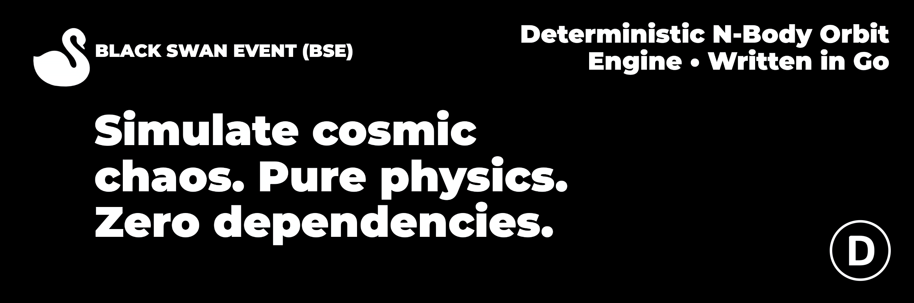

<p align="center">
  
</p>

<p align="center">
  <a href="LICENSE"></a>
  
  
  
</p>

---

**Black Swan Event (BSE)** — детерминированный N-body симулятор орбитальной механики, написанный с нуля на чистом Go. Никаких внешних физических библиотек, никаких обращений к API. Только закон всемирного тяготения, интегратор Верле и локальные JSON-сценарии.

Движок умеет моделировать стабильные системы и «чёрных лебедей» — внезапные катастрофы вроде пролёта массивной чёрной дыры сквозь Солнечную систему, с корректным поглощением тел, сохранением импульса и опциональными постньютоновскими поправками.

## ✨ Возможности

- **Ноль зависимостей.** Только стандартная библиотека Go.
- **Детерминизм.** Одинаковые начальные условия дают побитово одинаковый результат.
- **Symplectic Velocity Verlet.** Сохраняет энергию на миллионах шагов.
- **Адаптивный шаг.** При сближении тел `dt` дробится, чтобы не терять точность.
- **Слияние тел.** Сохранение массы, импульса и радиуса Шварцшильда для чёрных дыр.
- **Постньютоновские поправки.** Первый порядок по формуле Эйнштейна–Инфельда–Хоффмана, включается флагом `--relativity`.
- **CLI и визуализатор.** Батчевые расчёты и локальный веб-просмотр в одном репозитории.

## 🛠️ Архитектура

```text
black-swan/
├── .github/             # CI, шаблоны issue и PR
├── assets/              # Баннер и медиа
├── presets/             # JSON-сценарии
├── pkg/
│   ├── bse/             # Векторы, тела, движок, релятивизм
│   └── parser/          # Загрузка и валидация пресетов
└── apps/
    ├── cli/             # CLI-расчётчик
    └── webview/         # Локальный веб-визуализатор
```

## 🧠 Физика

Для каждой пары тел движок считает гравитационное ускорение:

$$\vec{a}_i = G \sum_{j \neq i} \frac{m_j (\vec{x}_j - \vec{x}_i)}{|\vec{x}_j - \vec{x}_i|^3}$$

Интегрирование выполняется схемой Velocity Verlet:

1. $\vec{x}(t+\Delta t) = \vec{x}(t) + \vec{v}(t)\Delta t + \tfrac{1}{2}\vec{a}(t)\Delta t^2$
2. $\vec{v}(t+\tfrac{1}{2}\Delta t) = \vec{v}(t) + \tfrac{1}{2}\vec{a}(t)\Delta t$
3. Пересчёт $\vec{a}(t+\Delta t)$ по новым позициям.
4. $\vec{v}(t+\Delta t) = \vec{v}(t+\tfrac{1}{2}\Delta t) + \tfrac{1}{2}\vec{a}(t+\Delta t)\Delta t$

В знаменатель добавлен softening-фактор $\varepsilon^2 = 10^6\,\text{м}^2$, чтобы исключить деление на ноль.

### Постньютоновские поправки

Флаг `--relativity` добавляет член первого порядка:

$$\vec{a}_{i,\text{GR}} = \frac{G M}{c^2 r^3} \left[ \left( \frac{4GM}{r} - v^2 \right) \vec{r} + 4(\vec{r} \cdot \vec{v}) \vec{v} \right]$$

где $M = m_i + m_j$, $\vec{r}$ и $\vec{v}$ — относительные координата и скорость. Для Меркурия это даёт классические 43 угловые секунды на век.

## 🚀 Быстрый старт

```bash
git clone https://github.com/datekt/black-swan.git
cd black-swan
```

### CLI

```bash
go run ./apps/cli --preset presets/solar_system.json --days 365
go run ./apps/cli --preset presets/rogue_black_hole.json --days 180
go run ./apps/cli --preset presets/solar_system.json --days 36500 --relativity
```

Результат сохраняется в `output/trajectory.json`.

### Визуализатор

В одном окне:

```bash
go run ./apps/cli --preset presets/rogue_black_hole.json --days 180
```

В другом:

```bash
go run ./apps/webview
```

Открыть `http://localhost:8080`. Данные подтягиваются из `output/` автоматически, копировать файлы не нужно.

### Makefile

```bash
make build      # Собрать bse-cli и bse-web
make run-cli    # Запустить CLI на solar_system
make run-web    # Запустить веб-сервер
make test       # Все тесты с race detector
make fmt vet    # Форматирование и статический анализ
make clean      # Удалить артефакты сборки
```

На Windows без GNU Make используйте команды `go run` напрямую.

## 📦 Пресеты

| Файл | Что моделирует |
|------|----------------|
| `presets/solar_system.json` | Стабильная Солнечная система, 3 тела, нулевой суммарный импульс |
| `presets/rogue_black_hole.json` | Чёрная дыра массой 10 M☉ влетает в систему и поглощает Солнце |

Свой сценарий — обычный JSON. Схема описана в `pkg/parser/json.go` и валидируется при загрузке: пустые имена, отрицательные массы, `NaN`, дубликаты и лишние поля отвергаются.

## 🗺️ Roadmap

- [x] Velocity Verlet + softening
- [x] Адаптивный шаг
- [x] Слияние тел с сохранением импульса
- [x] Радиус Шварцшильда для чёрных дыр
- [x] Постньютоновские поправки
- [ ] Barnes–Hut для $O(n \log n)$ на тысячах тел
- [ ] Экспорт траекторий в CSV
- [ ] Пресеты с поясом астероидов
- [ ] Событийная лента в веб-визуализаторе

## 🤝 Контрибьютинг

PR и issue приветствуются. Перед отправкой PR прогоните `make fmt vet test`. Шаблоны issue лежат в `.github/ISSUE_TEMPLATE/`, шаблон PR — в `.github/PULL_REQUEST_TEMPLATE.md`.

## 🛡️ Лицензия

GNU GPL v3. Любая производная работа, включающая ядро BSE, должна распространяться под той же лицензией. Полный текст — в файле [LICENSE](LICENSE).